# 🩺 Informe de Evidencias — Backend SeñaVida

<p align="center">
  
  
  
  
  
</p>

> Evidencia completa de funcionamiento del backend de **SeñaVida**, probada endpoint por endpoint con **Postman** y verificada a nivel de base de datos con **Tinker**. Este documento acompaña la entrega del **EVA2** y demuestra, con capturas reales (no simuladas), que el proyecto cumple cada indicador de la rúbrica.

| | |
|---|---|
| 👩‍💻 **Estudiante** | Greudy Inoa |
| 🎓 **Institución** | Instituto Profesional San Sebastián |
| 📦 **Proyecto** | SeñaVida — Backend API REST |
| 🔗 **Repositorio** | [`GreudyInoa/senavida-backend-eva2`](https://github.com/GreudyInoa/senavida-backend-eva2) |
| ⚙️ **Stack** | Laravel 13 · PHP 8.4 · PostgreSQL · Laravel Sanctum |
| 📅 **Fecha de entrega** | 17 de agosto de 2026 |

---

## 📑 Índice

1. [¿Qué es este documento y por qué existe?](#1-qué-es-este-documento-y-por-qué-existe)
2. [Configuración del entorno y la base de datos](#2-configuración-del-entorno-y-la-base-de-datos)
3. [Evidencias de Autenticación](#3-evidencias-de-autenticación)
4. [Evidencias de Registro de Usuarios y Cifrado](#4-evidencias-de-registro-de-usuarios-y-cifrado)
5. [Evidencias de Catálogos](#5-evidencias-de-catálogos)
   - 5.1–5.3 Creación de Organización, Centros y Unidades
   - 5.4 Control de roles (RBAC) · 5.5–5.7 Listados · 5.8 Multitenancy
6. [Cumplimiento de la rúbrica](#6-cumplimiento-de-la-rúbrica)
7. [Glosario rápido](#7-glosario-rápido)

---

## 1. ¿Qué es este documento y por qué existe?

Cuando se construye una API, es fácil demostrar que "funciona" con palabras — pero lo que realmente convence es **verla funcionar de verdad**, con datos reales entrando y saliendo del servidor. Eso es justo lo que hace este informe: por cada pieza importante del backend, muestra la **petición que se envió** y la **respuesta que devolvió el servidor**, tal como sucedió, sin inventar ni simular nada.

Piénsalo como el cuaderno de bitácora de un examen práctico de manejo: no basta con decir "sé estacionar en paralelo", hay que mostrarlo estacionando de verdad, con el examinador mirando. Cada captura de este documento es esa prueba: el examinador (en este caso, quien evalúa el EVA2) puede ver exactamente qué se envió y qué respondió el sistema, código HTTP incluido.

### ¿Cómo se probó todo esto?

Se usaron dos herramientas complementarias:

- **[Postman](https://www.postman.com/):** una aplicación que permite enviar peticiones HTTP (como si fuera un navegador, pero más flexible) directamente a los endpoints de la API, sin necesidad de tener un frontend construido todavía.
- **[Tinker](https://laravel.com/docs/artisan#tinker):** una consola interactiva que trae Laravel, donde se pueden ejecutar comandos de PHP directamente contra la base de datos real del proyecto. Se usó puntualmente para **verificar** que lo que Postman mostraba en pantalla realmente había quedado guardado (y correctamente cifrado) en PostgreSQL.

### La arquitectura en una frase

El backend es una **API REST versionada** (todas las rutas viven bajo `/api/v1`), que no devuelve páginas HTML sino **JSON puro**, protegida con **tokens Bearer de Laravel Sanctum** (el "carnet de identidad digital" que cada usuario recibe al hacer login y debe mostrar en cada petición siguiente), y con **PostgreSQL** como base de datos.

---

## 2. Configuración del entorno y la base de datos

> 💡 **¿Por qué empezar por aquí?** Antes de mostrar que un endpoint responde bien, hay que demostrar algo más básico: que el proyecto realmente está hablando con **PostgreSQL** y no con otra base de datos, o peor, con ninguna. Esta sección es la base de todo lo demás — si esto falla, nada más importa.

### 2.1 Variables de entorno (`.env`)

> **Qué demuestra:** que la conexión a PostgreSQL está correctamente configurada en las variables de entorno, tal como exige el Indicador 1 de la rúbrica.

El archivo `.env` es donde Laravel guarda toda la configuración que **depende del entorno** (local, producción, testing) y que **nunca debe subirse a GitHub** tal cual, porque contiene credenciales. Aquí es donde se le dice a Laravel: "conéctate a esta base de datos, en esta dirección, con este usuario y esta contraseña".


La captura muestra el bloque de conexión a base de datos: `DB_CONNECTION=pgsql`, `DB_HOST=127.0.0.1`, `DB_PORT=5432`, `DB_DATABASE=senavida`, `DB_USERNAME=postgres`. Esto confirma que el proyecto está configurado para conectarse a **PostgreSQL**, tal como exige el enunciado.

> 🔒 **Buena práctica aplicada:** el valor real de `DB_PASSWORD` fue cubierto intencionalmente en la captura antes de subir este informe al repositorio público de GitHub — evitando exponer una credencial real, tal como haría cualquier desarrollador profesional.

### 2.2 Verificación de la conexión (`php artisan about`)

> **Qué demuestra:** que Laravel está conectado a PostgreSQL de verdad (no solo declarado en el `.env`, sino en ejecución).

`php artisan about` es un comando que muestra una "ficha técnica" completa del proyecto en el momento exacto en que se ejecuta: versión de Laravel, de PHP, y — lo más importante aquí — a qué motor de base de datos está conectado *ahora mismo*.


La salida del comando confirma la configuración real del proyecto en ejecución: `Laravel Version 13.23.0`, `PHP Version 8.4.24`, y en la sección **Drivers → Database: `pgsql`**. Esto prueba que la aplicación está efectivamente conectada a PostgreSQL, no solo declarado en el `.env`.

### 2.3 Migraciones ejecutadas (`php artisan migrate:status`)

> **Qué demuestra:** que todas las tablas del sistema se crearon correctamente.

Las **migraciones** son como planos de construcción para la base de datos: cada archivo de migración describe una tabla (sus columnas, tipos de dato, relaciones). `migrate:status` muestra cuáles de esos planos ya se "construyeron" de verdad en PostgreSQL.

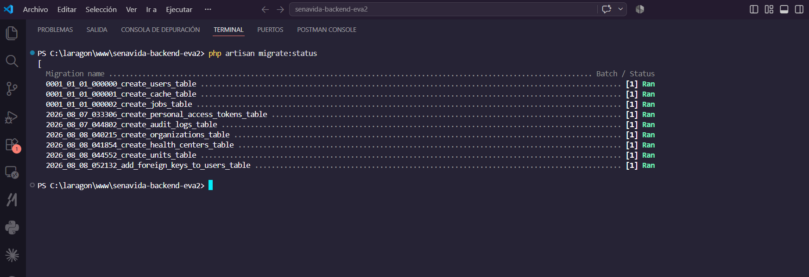

Todas las migraciones del proyecto figuran en estado **`Ran`**, incluyendo `create_users_table`, `create_personal_access_tokens_table` (Sanctum), `create_audit_logs_table`, `create_organizations_table`, `create_health_centers_table`, `create_units_table` y `add_foreign_keys_to_users_table`. Esto confirma que todas las tablas del sistema fueron creadas correctamente en PostgreSQL.

---

## 3. Evidencias de Autenticación

> 💡 **¿Qué se está probando aquí?** La autenticación es el "portero" del sistema: decide quién entra y quién no. Un buen sistema de login no solo debe **aceptar** las credenciales correctas — también debe **rechazar** las incorrectas, **protegerse** contra quien intente adivinar contraseñas a la fuerza, y **saber revocar el acceso** cuando alguien cierra sesión. Esta sección prueba las cinco caras de esa moneda.

El siguiente diagrama resume el flujo completo, de principio a fin, antes de entrar al detalle de cada endpoint:

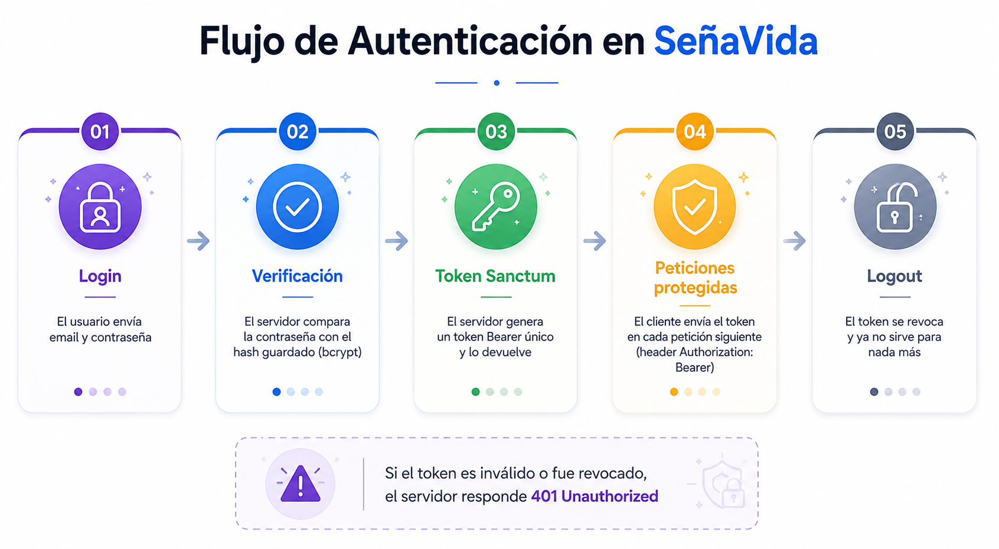

### 3.1 Login exitoso

> **Endpoint:** `POST /api/v1/auth/login`
> **Qué demuestra:** que un usuario con credenciales correctas recibe un token Sanctum válido.

**Petición enviada:**
```json
{
  "email": "medico.maternidad@test.com",
  "password": "password123"
}
```

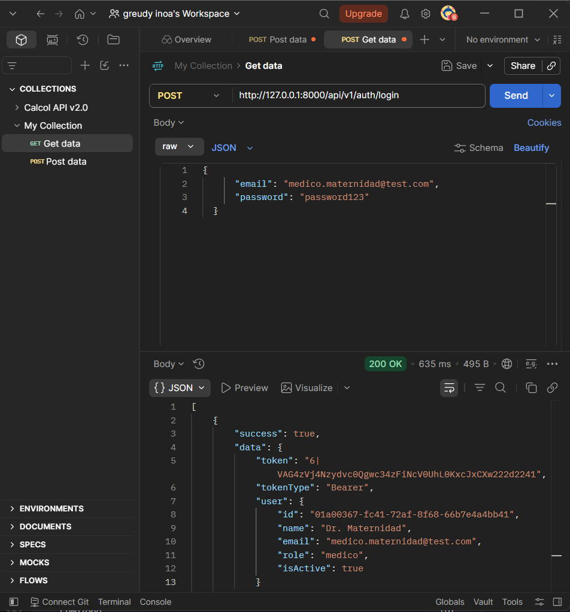

**Resultado obtenido:** `200 OK` en `635 ms`. La respuesta incluye `"success": true` y dentro de `"data"`: el `token` de Sanctum (`6|VAG4zVj4Nzydvc0Qgwc34zFiNcV0UhL0KxcJxCXw222d2241`), el `tokenType: "Bearer"`, y los datos del usuario autenticado (`id`, `name: "Dr. Maternidad"`, `email`, `role: "medico"`, `isActive: true`).

Esto confirma que el login **valida las credenciales de verdad** y entrega un token Bearer real de Sanctum, listo para usarse en los siguientes endpoints protegidos.

---

### 3.2 Login fallido (credenciales inválidas)

> **Endpoint:** `POST /api/v1/auth/login`
> **Qué demuestra:** que el sistema rechaza credenciales incorrectas y no entrega token. Esto prueba que el login **valida de verdad** (no acepta cualquier cosa).

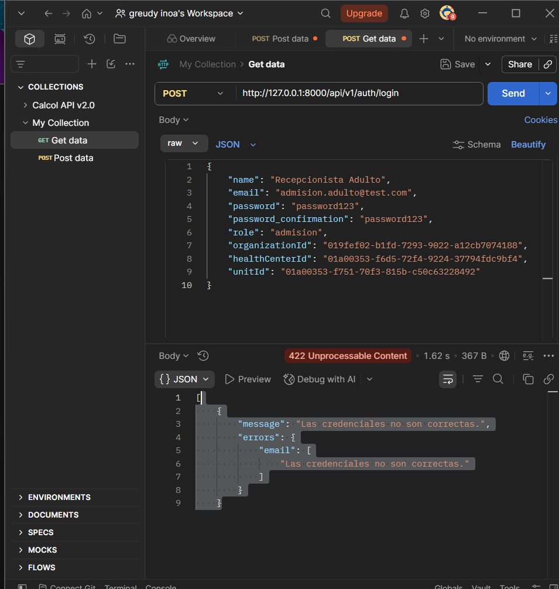

**Resultado obtenido:** `422 Unprocessable Content` en `1.62 s`. La respuesta indica `"message": "Las credenciales no son correctas."`, con el detalle del error en `"errors" → "email"`.

Esto confirma que el endpoint **rechaza credenciales incorrectas** y no entrega ningún token, cerrando la puerta a accesos no autorizados.

---

### 3.3 Protección contra fuerza bruta (rate limiting)

> **Endpoint:** `POST /api/v1/auth/login`
> **Qué demuestra:** que tras varios intentos fallidos seguidos, el sistema bloquea temporalmente los intentos (protección de seguridad profesional).

**Respuesta esperada:** al 6.º intento fallido, `429 Too Many Requests` con el mensaje de segundos de espera.


**Resultado obtenido:** tras 5 intentos fallidos consecutivos con credenciales incorrectas, el 6.º intento devolvió `429 Too Many Requests` en `265 ms`, con el mensaje `"Demasiados intentos. Intenta de nuevo en 16 segundos."`.

Esto confirma que el `RateLimiter` de Laravel está protegiendo activamente el endpoint de login contra ataques de fuerza bruta, bloqueando temporalmente el email/IP tras superar el máximo de intentos permitidos.

---

### 3.4 Endpoint `/me` (usuario autenticado)

> **Endpoint:** `GET /api/v1/auth/me`
> **Qué demuestra:** que un token válido permite identificar al usuario dueño de la sesión. Prueba que el **middleware de autenticación** (`auth:sanctum`) funciona.

**Configuración:** en Postman, pestaña **Authorization → Bearer Token**, pegar el token obtenido en el login (copiado directamente desde la respuesta, nunca transcrito a mano).


**Resultado obtenido:** `200 OK` en `371 ms`. La respuesta devuelve `"success": true` y dentro de `"data" → "user"` los datos del usuario autenticado: `id`, `name: "Super Admin"`, `email: "superadmin@test.com"`, `role: "super_admin"`, `isActive: true`.

Esto confirma que el middleware `auth:sanctum` valida correctamente el token Bearer y resuelve la identidad del usuario dueño de la sesión.

---

### 3.5 Logout (revocación del token)

> **Endpoint:** `POST /api/v1/auth/logout`
> **Qué demuestra:** que el cierre de sesión **revoca el token**, de modo que ya no sirve para nada después.

**Respuesta esperada:** `200 OK` confirmando el cierre de sesión.

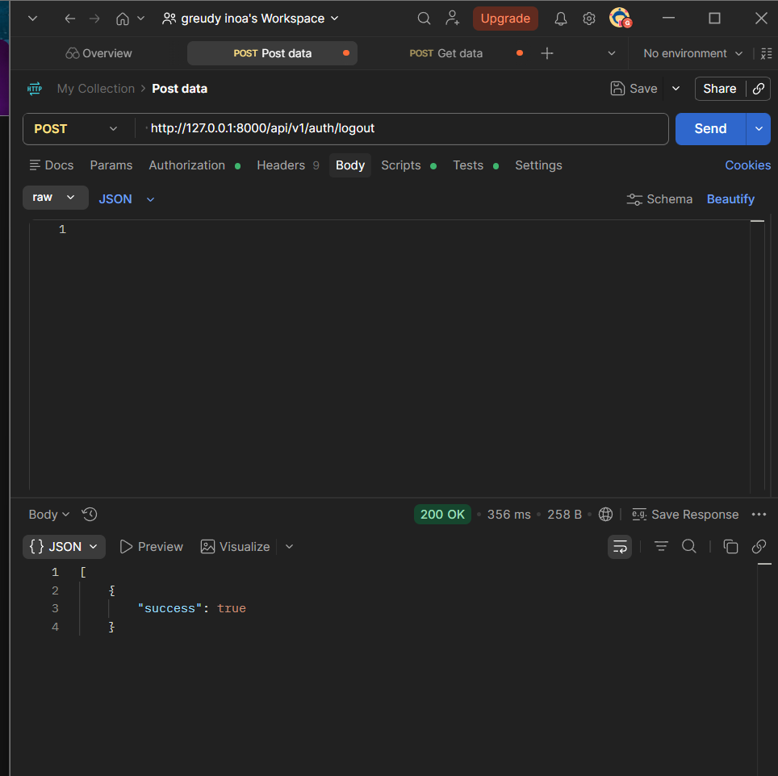

**Resultado obtenido:** `200 OK` en `356 ms`, con `"success": true`. Esto confirma que la petición de logout se procesó correctamente sobre el token activo del `super_admin`.

**Prueba complementaria (opcional pero potente):** volver a llamar a un endpoint protegido con el **mismo token** después del logout → debe devolver `401 Unauthorized`.


**Resultado obtenido:** al reutilizar el mismo token (`11|...`) después de haber cerrado sesión con él, la API devuelve `401 Unauthorized` con `"message": "No autenticado."`.

Esto demuestra que el logout **revoca el token de verdad** en la base de datos — no es solo una respuesta de cortesía en el frontend; el token queda inservible para cualquier petición posterior.

---

## 4. Evidencias de Registro de Usuarios y Cifrado

> 💡 **¿Por qué esta sección es tan importante?** Guardar una contraseña **tal como el usuario la escribió** (en "texto plano") es uno de los errores de seguridad más graves que puede cometer un sistema — si alguien accede a la base de datos, tendría todas las contraseñas reales. Por eso, ningún backend serio guarda contraseñas así: las **cifra** con un algoritmo que las convierte en un texto irreversible (un *hash*). Esta sección demuestra, con evidencia directa en la base de datos, que SeñaVida hace esto correctamente. Es, además, el **Indicador 3** completo de la rúbrica.

### 4.1 Registro de usuario exitoso

> **Endpoint:** `POST /api/v1/users`
> **Qué demuestra:** que un administrador autenticado puede crear un usuario nuevo, con todas las validaciones.

**Petición enviada:**
```json
{
  "name": "Enfermera de Prueba",
  "email": "enfermera.prueba@test.com",
  "password": "password123",
  "password_confirmation": "password123",
  "role": "categorizacion",
  "organizationId": "01a003c6-e068-71b0-8165-7657c0a84b44",
  "healthCenterId": "01a003c8-20e8-7095-b24b-08918e04f79a",
  "unitId": "01a003c9-6a18-73c6-bc23-70b80f0395fa"
}
```

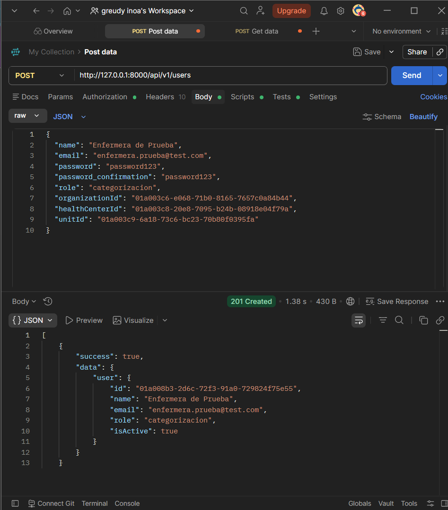

**Resultado obtenido:** `201 Created` en `1.38 s`. La respuesta devuelve `"success": true` y los datos del usuario creado (`id`, `name: "Enfermera de Prueba"`, `email`, `role: "categorizacion"`, `isActive: true`) — **sin incluir la contraseña en ningún formato**, ni siquiera cifrada.

Esto confirma que el endpoint crea correctamente un usuario nuevo, asociado al Hospital San Rafael → Urgencia Adulto, y que la respuesta respeta la buena práctica de nunca exponer la contraseña.

---

### 4.2 Prueba del cifrado en la base de datos (Tinker) ⭐

> **Qué demuestra:** que la contraseña **NO se guarda en texto plano**, sino cifrada con bcrypt. **Esta es la evidencia clave del cifrado.**

**Comando ejecutado en Tinker:**
```php
User::where('email', 'enfermera.prueba@test.com')->first()->password;
```

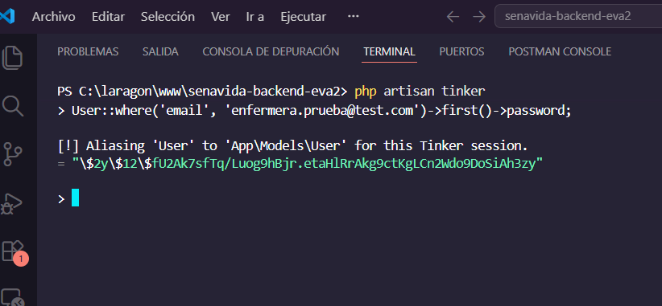

**Resultado obtenido:**
```
$2y$12$fU2Ak7sfTq/Luog9hBjr.etaHlRrAkg9ctKgLCn2Wdo9DoSiAh3zy
```

> **Explicación:** aunque en Postman se envió la contraseña `password123` en texto plano, en la base de datos quedó guardada como un hash irreversible en formato **bcrypt** (`$2y$12$...`, donde `12` es el número de rondas de cifrado configurado en `BCRYPT_ROUNDS`). Esto se logra con el cast `'password' => 'hashed'` en el modelo `User`, que cifra automáticamente la contraseña al guardarla — sin necesidad de llamar a `Hash::make()` manualmente en el controlador.

---

### 4.3 Validación de datos duplicados

> **Endpoint:** `POST /api/v1/users`
> **Qué demuestra:** que el sistema rechaza crear un usuario con un email que ya existe (regla `unique`).

**Respuesta esperada:** `422 Unprocessable Content` con el mensaje de que el email ya está en uso.


**Resultado obtenido:** `422 Unprocessable Content` en `424 ms`, con el mensaje `"The email has already been taken."`. La misma petición del punto 4.1, repetida sin cambios, fue rechazada por la regla de validación `unique` sobre el campo `email`.

Esto confirma que el sistema **evita duplicados a nivel de servidor**, no solo a nivel de interfaz — cualquier intento de crear dos cuentas con el mismo correo es bloqueado.

---

## 5. Evidencias de Catálogos

> 💡 **¿Qué son los "catálogos" en este proyecto?** SeñaVida no atiende a un solo hospital: está pensado para que **varias organizaciones de salud** (por ejemplo, distintos servicios de salud regionales) usen el mismo sistema, cada una con sus propios hospitales (**centros de salud**) y, dentro de cada hospital, sus propias salas (**unidades**, como "Urgencia Adulto" o "Maternidad"). Estas tres entidades forman una jerarquía: `Organización → Centro de Salud → Unidad`. Esta sección prueba que esa jerarquía se puede crear y consultar correctamente por la API — y de paso, revela dos capas de seguridad extra que no eran obligatorias, pero que hacen al sistema más robusto: control de roles y aislamiento de datos entre hospitales.

El siguiente diagrama resume visualmente esa jerarquía, con datos reales del proyecto (los mismos que se crean y consultan en esta sección):


### 5.1 Crear Organización

> **Endpoint:** `POST /api/v1/organizations`
> **Qué demuestra:** que un `super_admin` puede dar de alta una nueva organización de salud desde cero.

**Petición enviada:**
```json
{
  "name": "Servicio de Salud Metropolitano"
}
```

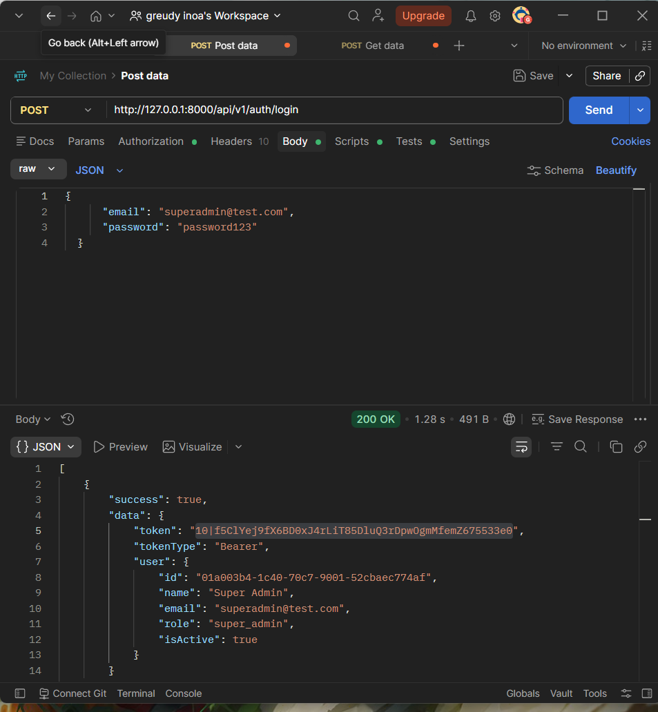

**Resultado obtenido:** `201 Created` en `908 ms`, devolviendo el `id` (UUID) generado y el `name` de la organización creada.

---

### 5.2 Crear Centro de Salud

> **Endpoint:** `POST /api/v1/health-centers`
> **Qué demuestra:** que un centro de salud se crea vinculado a su organización mediante `organizationId`.

**Petición 1 — "Hospital San Rafael":**
```json
{
  "name": "Hospital San Rafael",
  "organizationId": "01a003c6-e068-71b0-8165-7657c0a84b44"
}
```

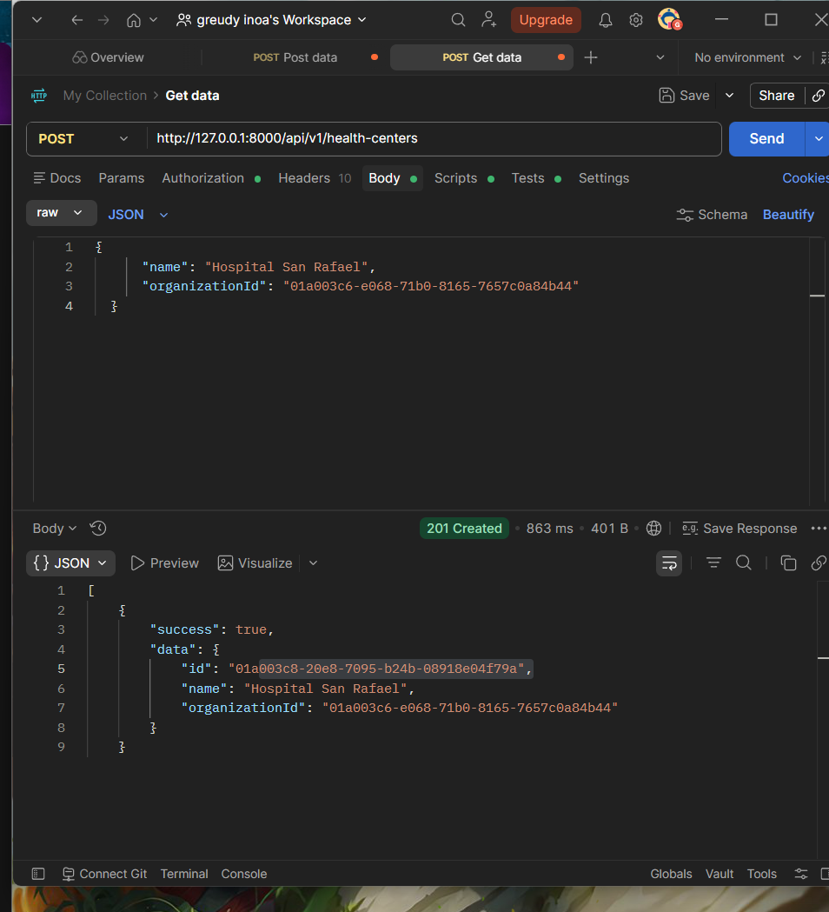

**Resultado obtenido:** `201 Created` en `863 ms`.

**Petición 2 — "Hospital Santa Lucía" (segundo centro, misma organización):**
```json
{
  "name": "Hospital Santa Lucía",
  "organizationId": "01a003c6-e068-71b0-8165-7657c0a84b44"
}
```

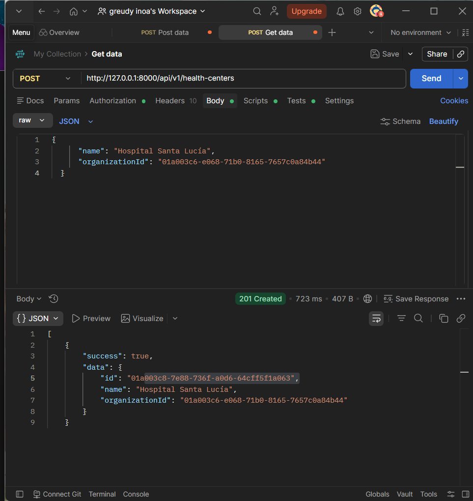

**Resultado obtenido:** `201 Created` en `723 ms`. Ambos centros quedan asociados a la misma `organizationId`, confirmando que una organización puede tener múltiples centros de salud (relación `hasMany`).

---

### 5.3 Crear Unidad

> **Endpoint:** `POST /api/v1/units`
> **Qué demuestra:** que una unidad se crea vinculada a su centro de salud mediante `healthCenterId`.

**Petición 1 — "Urgencia Adulto":**
```json
{
  "name": "Urgencia Adulto",
  "healthCenterId": "01a003c8-20e8-7095-b24b-08918e04f79a"
}
```


**Resultado obtenido:** `201 Created` en `679 ms`.

**Petición 2 — "Urgencia Infantil" (segunda unidad, mismo centro):**
```json
{
  "name": "Urgencia Infantil",
  "healthCenterId": "01a003c8-20e8-7095-b24b-08918e04f79a"
}
```


**Resultado obtenido:** `201 Created` en `752 ms`. Ambas unidades quedan asociadas al mismo `healthCenterId`, confirmando que un centro de salud puede tener múltiples unidades (relación `hasMany`).

> **Nota:** de la misma forma se crearon el resto de las unidades del sistema: "Maternidad" para el Hospital San Rafael, y "Urgencia Adulto", "Traumatología", "Pediatría" para el Hospital Santa Lucía, completando el catálogo que se muestra en el listado de la sección 5.7.
>
> 

---

### 5.4 Evidencia adicional — Control de roles (RBAC) en el registro de usuarios

> Esta evidencia complementa la sección 4: confirma que **solo los roles autorizados** (`admin_institucional`, `super_admin`) pueden crear usuarios nuevos — cualquier otro rol autenticado es rechazado, incluso si su token es válido.

El siguiente diagrama resume la regla que se prueba a continuación: quién puede crear qué dentro del sistema.

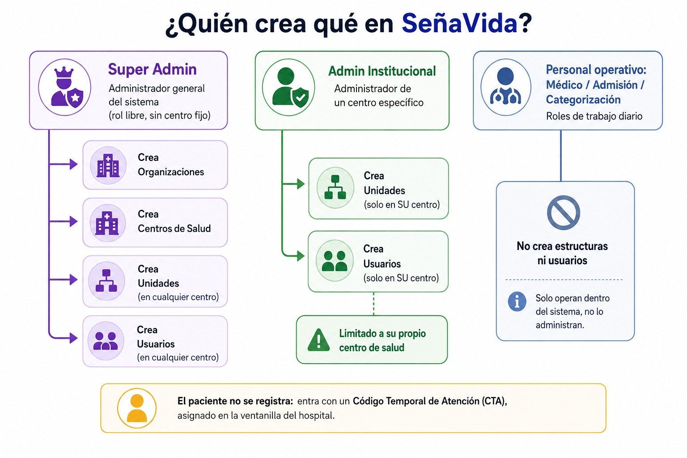

**Caso permitido — usuario con rol autorizado:**


**Resultado obtenido:** `201 Created` en `1.26 s`. El usuario "Enfermero Uno SR" se registró correctamente porque quien hizo la petición tenía un rol con permiso para crear usuarios.

**Caso bloqueado — usuario con rol sin autorización:**


**Resultado obtenido:** `403 Forbidden` en `766 ms`, con el mensaje `"No tienes permiso para registrar usuarios."`, usando la misma petición pero un token de un rol sin autorización para esta acción.

Esto confirma que el control de acceso por rol (RBAC) está aplicado **a nivel de servidor**, no solo ocultando botones en el frontend — un token válido no es suficiente por sí solo; el rol del usuario también se verifica en cada operación sensible.

---

### 5.5 Listado de Organizaciones

> **Endpoint:** `GET /api/v1/organizations`
> **Qué demuestra:** que las organizaciones creadas en el punto 5.1 se persisten correctamente en PostgreSQL y se pueden consultar vía API.


**Resultado obtenido:** `200 OK` en `736 ms`, con `"success": true` y un arreglo `"data"` que incluye las organizaciones registradas.

---

### 5.6 Listado de Centros de Salud

> **Endpoint:** `GET /api/v1/health-centers`
> **Qué demuestra:** que los centros de salud creados en el punto 5.2 están correctamente vinculados a su organización.

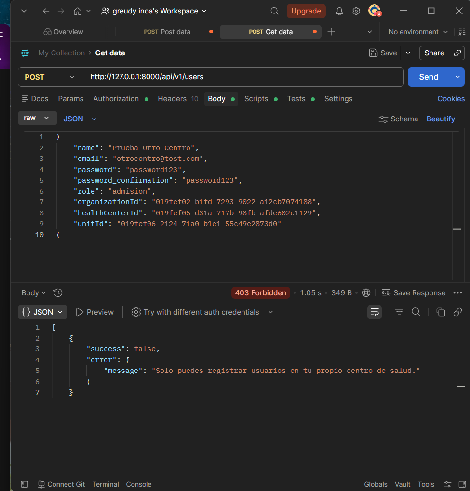

**Resultado obtenido:** `200 OK` en `691 ms`. Cada centro ("Hospital San Rafael", "Hospital Clínico Sur") muestra su `organizationId` correspondiente, confirmando la relación `belongsTo` entre `HealthCenter` y `Organization`.

---

### 5.7 Listado de Unidades

> **Endpoint:** `GET /api/v1/units` — con y sin filtro por centro de salud
> **Qué demuestra:** que las unidades creadas en el punto 5.3 están correctamente vinculadas a su centro de salud, y que el endpoint soporta filtrado por `healthCenterId`.

**Sin filtro (todas las unidades):**


**Resultado obtenido:** `200 OK` en `732 ms`, con todas las unidades del sistema y su `healthCenterId` respectivo.

**Con filtro por centro de salud (`?healthCenterId=...`):**

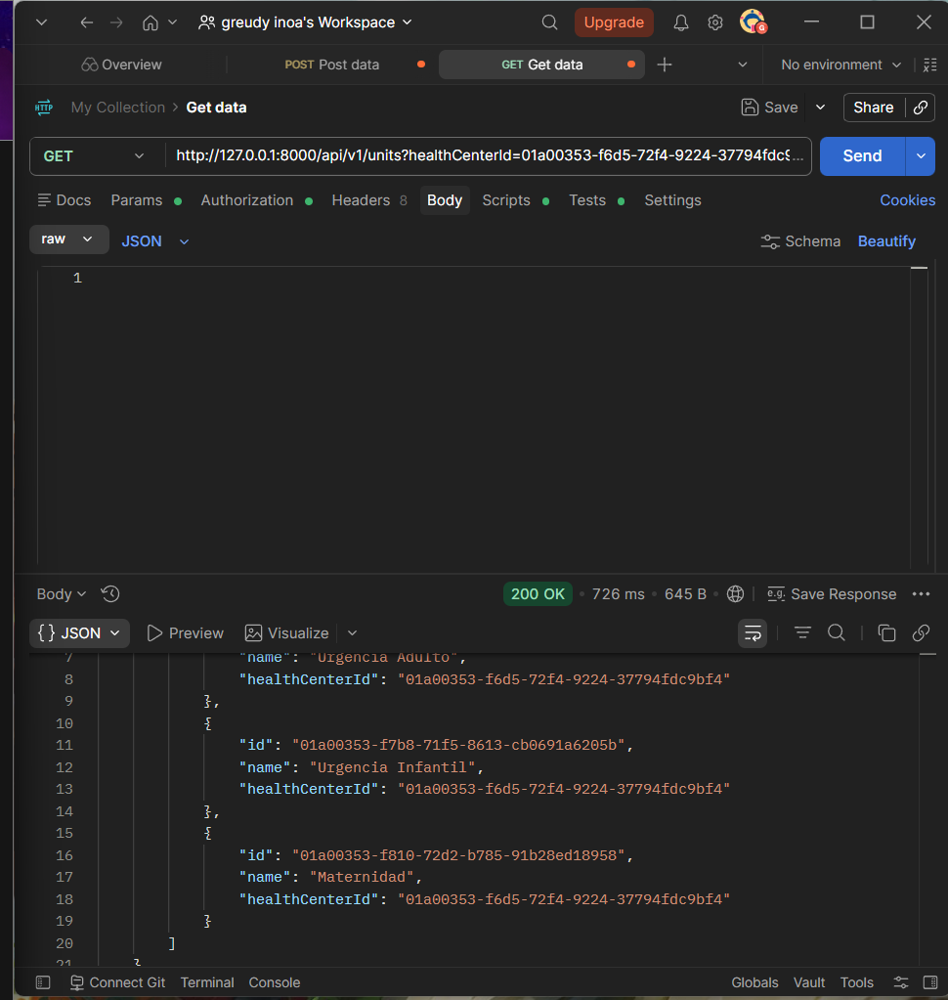

**Resultado obtenido:** `200 OK` en `726 ms`, devolviendo únicamente las unidades del centro solicitado ("Urgencia Adulto", "Urgencia Infantil", "Maternidad"), confirmando que el filtro por query param funciona correctamente.

---

### 5.8 Evidencia adicional — Aislamiento por multitenancy

> Esta evidencia no estaba en el plan original, pero refuerza un aspecto de seguridad importante del sistema: que un `admin_institucional` **solo puede gestionar usuarios de su propio centro de salud**, nunca de otro.

**Caso permitido — registrar en el propio centro:**

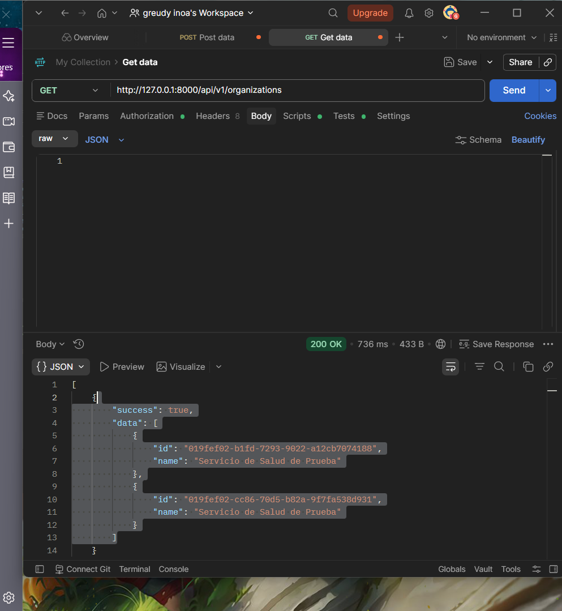

**Resultado obtenido:** `201 Created`. El usuario `admin_institucional` registró exitosamente a "Prueba Mismo Centro" porque el `healthCenterId` enviado coincide con el centro al que pertenece.

**Caso bloqueado — intento de registrar en otro centro:**


**Resultado obtenido:** `403 Forbidden` en `1.05 s`, con el mensaje `"Solo puedes registrar usuarios en tu propio centro de salud."`. El mismo `admin_institucional` intentó registrar un usuario en un centro de salud distinto al suyo, y el sistema lo rechazó.

Esto confirma que la restricción de **multitenancy** no es solo una regla de negocio documentada, sino que está **implementada y forzada activamente en el servidor**, evitando que un administrador institucional gestione datos fuera de su propio centro.

---

## 6. Cumplimiento de la rúbrica

Esta tabla resume cómo cada indicador de la rúbrica queda cubierto por las evidencias de este informe.

| Indicador de la rúbrica | Puntos | Evidencia en este informe | Estado |
|---|---|---|---|
| **1.** Conexión BD + configuración en `.env` + modelos | 33 | Sección 2 (`.env`, `about`, `migrate:status`) + Sección 5.1–5.7 (creación y listado de catálogos) | ✅ |
| **2.** Login + middleware de autenticación | 34 | Sección 3 (login, `/me`, logout, rate limiting) | ✅ |
| **3.** Registro de usuario con cifrado de contraseña | 33 | Sección 4 (registro 201 + hash `$2y$12$` en Tinker + control de duplicados) | ✅ |
| **TOTAL** | **100** | | ✅ |

> **Evidencia adicional no exigida por la rúbrica:** las secciones 5.4 (control de roles/RBAC) y 5.8 (multitenancy) documentan capas de seguridad extra que refuerzan la solidez del sistema más allá de los tres indicadores mínimos.

---

## 7. Glosario rápido

Para quien lea este informe sin ser parte del proyecto (por ejemplo, un evaluador que quiera repasar los términos técnicos):

| Término | En palabras simples |
|---|---|
| **API REST** | Una forma estándar de organizar un backend para que hable en JSON con cualquier frontend, a través de rutas como `/api/v1/...` |
| **Endpoint** | Una "puerta" específica de la API — por ejemplo, `POST /api/v1/auth/login` es el endpoint del login |
| **Token Bearer** | Una especie de carnet digital temporal que el servidor entrega al hacer login, y que hay que "mostrar" (enviar en el header `Authorization`) en cada petición siguiente para probar quién eres |
| **Sanctum** | El paquete de Laravel que genera, valida y revoca esos tokens |
| **Hash (bcrypt)** | El resultado de cifrar un texto de forma irreversible — no se puede "descifrar" de vuelta a la contraseña original, solo comparar si otro texto genera el mismo hash |
| **Rate limiting** | Un límite de cuántas veces se puede intentar algo (como el login) en un período de tiempo, para frenar ataques de fuerza bruta |
| **RBAC** (*Role-Based Access Control*) | Control de acceso basado en el rol del usuario: no todos los usuarios autenticados pueden hacer todo, algunas acciones están reservadas a ciertos roles |
| **Multitenancy** | Que un mismo sistema sirva a varios "inquilinos" (en este caso, hospitales) manteniendo sus datos completamente separados entre sí |
| **Migración** | Un archivo de código que describe cómo crear o modificar una tabla en la base de datos, de forma que el esquema completo se pueda reconstruir en cualquier máquina |
| **Tinker** | La consola interactiva de Laravel para ejecutar código PHP directamente contra el proyecto y su base de datos |

---

<p align="center">
  <sub>Informe de evidencias — Proyecto <strong>SeñaVida</strong> · Backend API REST · EVA2 · Instituto Profesional San Sebastián</sub>
</p>
